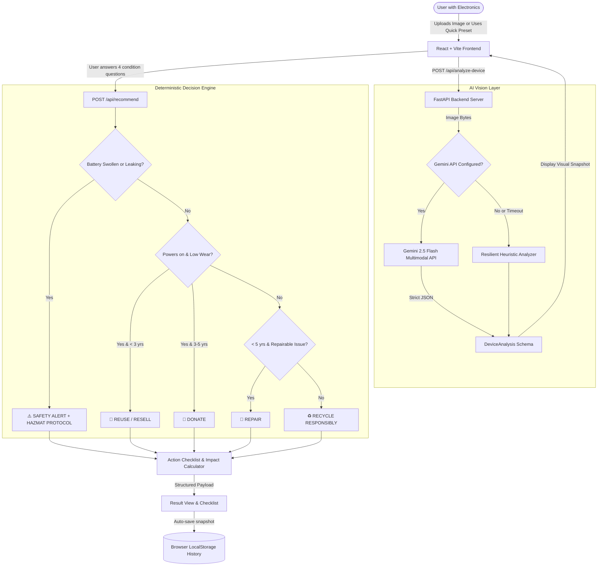

# ♻️ EcoSort AI

> **Know it. Decide it. Recycle it responsibly.**

[](https://harsh-sahu1.github.io/ecosort-ai/)
[](https://github.com/harsh-sahu1/ecosort-ai)

**Live Web Application:** [https://harsh-sahu1.github.io/ecosort-ai/](https://harsh-sahu1.github.io/ecosort-ai/)

EcoSort AI is an intelligent decision assistant that reduces the friction between owning an unwanted electronic device and taking the right next step. Ordinary consumers upload a photo of an electronic item; the system classifies the hardware and visible wear, guides them through 4 critical condition questions, and triggers a deterministic recommendation engine to output an actionable plan: **Repair**, **Reuse**, **Donate**, **Recycle**, or **Safety Alert**.

---

## 1. The Problem

Every year, the world generates over **62 million metric tons** of electronic waste. Ordinary consumers often have old, broken, or obsolete electronics gathering dust in drawers because they don't know:
* What the item actually is or its component value.
* Whether it is economically worth repairing.
* Whether it is still viable for donation or secondary reuse.
* How to wipe personal data and securely prepare it for disposal.
* Whether swollen or degrading lithium batteries pose fire hazards.
* Where and how to responsibly dispose of it.

Existing alternatives force users to scour multiple forums or toss hazardous electronics into regular trash bins, causing landfill fires and heavy metal groundwater contamination.

---

## 2. The Solution

EcoSort AI eliminates guesswork with a structured 60-second workflow:

$$\text{Photo} \longrightarrow \text{Identification} \longrightarrow \text{Condition Assessment} \longrightarrow \text{Deterministic Decision} \longrightarrow \text{Action Checklist}$$

1. **Multimodal Identification**: Computer vision extracts the device category, brand cues, visible condition, and surface fractures.
2. **Condition Confirmation**: A concise 4-question assessment confirms critical factors that cameras cannot detect (power status, internal battery swelling, device age, and core symptom).
3. **Deterministic Recommendation Engine**: Evaluates safety rules first, followed by economic and circular viability rules to produce one of:
   * 🔧 **Repair**
   * 🔄 **Reuse**
   * 🎁 **Donate**
   * ♻️ **Recycle**
   * ⚠️ **Safety Alert**
4. **Actionable Checklist**: Step-by-step guidance on data backup, cloud account unlinking, factory resetting, and accredited drop-off procedures.
5. **Environmental Impact Estimation**: Transparent educational metrics highlighting circular material recovery (gold, silver, copper, lithium) and CO₂ mitigation.

---

## 3. Architecture



---

## 4. Tech Stack

| Layer | Technologies |
|---|---|
| **Frontend** | React 19, TypeScript, Vite 8, Tailwind CSS v4, Lucide Icons |
| **Backend** | Python 3.13, FastAPI, Uvicorn, Pydantic v2, Python-Multipart |
| **AI / Multimodal** | Google Gemini API (`google-genai` SDK) with strict JSON schema output |
| **Fail-Safe Fallback** | Heuristic fallback vision parser + Manual Device Category Selection Modal |
| **Storage** | Client-side `localStorage` for zero-friction history caching |

---

## 5. How It Works

### Deterministic Recommendation Rules (Safety-First)
Rather than trusting an LLM to hallucinate disposal advice, EcoSort AI uses strict deterministic logic:

1. **Safety First**:
   - If battery swelling, leaking, dangerous heating, or severe puncture is detected or reported:
   - 👉 Immediately triggers **`SAFETY_ALERT`**.
   - Prohibits DIY battery removal, charging, or curbside disposal. Provides immediate non-combustible containment steps and municipal household hazardous waste (HHW) drop-off instructions.
2. **Reuse & Resell**:
   - If device powers on, has no major hardware defect, and is modern (< 3 years old):
   - 👉 Recommends **`REUSE`**. Retaining functional hardware delays new manufacturing emissions.
3. **Donate**:
   - If device turns on, has only minor wear, and is safe (1–5 years old):
   - 👉 Recommends **`DONATE`** to schools, charities, or digital inclusion drives.
4. **Repair**:
   - If device has localized damage (e.g. cracked display, degraded battery) and is under 5 years old:
   - 👉 Recommends **`REPAIR`**. Provides guidance to benchmark repair costs (< 50% replacement value) and locate certified technicians.
5. **Recycle**:
   - If device is obsolete (> 5 years old), non-functional, or uneconomical to service:
   - 👉 Recommends **`RECYCLE`** through accredited e-waste streams to reclaim critical minerals (gold, silver, copper, rare earths).

---

## 6. Safety Limitations

> [!CAUTION]
> **Safety Disclaimer**: EcoSort AI provides preliminary decision guidance based on external visual cues and user responses. Computer vision cannot detect internal micro-fissures, chemical electrolyte volatility, or microscopic component failure. Never attempt DIY extraction of swollen or glued lithium-ion batteries. Always treat compromised battery packs as hazardous materials.

---

## 7. Quickstart Setup

### Prerequisites
* **Node.js** (v18+)
* **Python** (v3.10+)

### 1. Clone & Setup Backend
```bash
# Navigate to project root
cd Ecosort

# Create virtual environment
python -m venv .venv

# Activate virtual environment
# On Windows:
.venv\Scripts\activate
# On Linux/macOS:
source .venv/bin/activate

# Install dependencies
pip install -r backend/requirements.txt

# Optional: Add your Gemini API key in backend/.env
# If omitted, EcoSort AI automatically runs in fail-proof heuristic fallback mode.
echo "GEMINI_API_KEY=your_key_here" > backend/.env

# Start Backend Server
uvicorn app.main:app --host 127.0.0.1 --port 8000 --reload
```

### 2. Setup & Start Frontend
```bash
# Open a new terminal in the frontend directory
cd Ecosort/frontend

# Install dependencies
npm install

# Start Vite Dev Server
npm run dev
```

Open **`http://localhost:5173`** in your browser.

---

## 8. 1-Click Hackathon Demo Scenarios

EcoSort AI includes built-in quick test buttons for rapid 60-second judging:
* 📱 **Cracked Smartphone**: Tests repair vs reuse workflow with screen damage.
* 💻 **Damaged Laptop**: Tests component repair vs recycling assessment.
* ⚠️ **Swollen Battery**: Tests the critical **Safety Alert** fire prevention flow.
* 📟 **Working Tablet**: Tests the **Donate / Reuse** circular lifecycle workflow.
* 🛠️ **Manual Mode**: Testable even with zero camera access or network timeouts.

---

## 9. Future Scope

* 🗺️ **Verified Recycler Geo-Locator**: Real-time integration with certified local municipal e-waste depots and drop-off bins.
* 💰 **Fair-Market Resale Estimator**: Live valuation integration for used and refurbished electronics marketplaces.
* 🔒 **Automated Cryptographic Data Wiping Verification**: Step-by-step verified wiping checklists for Android, iOS, Windows, and macOS.
* 🌐 **Multilingual Accessibility**: Localized languages for global e-waste management education.
* 🏷️ **Brand & Manufacturer Take-Back Directories**: Direct lookup for Apple Trade-In, Dell Reconnect, Samsung Care, and OEM recycling initiatives.

---

## 10. License

MIT License. Developed for open innovation and sustainable circular technology.
